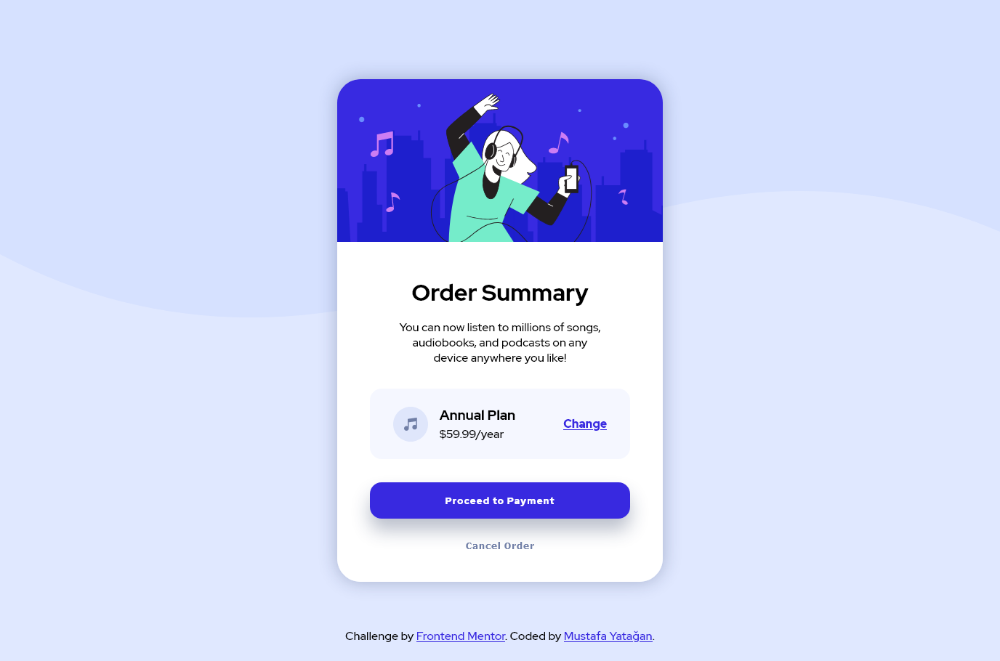

# Frontend Mentor - Order summary card solution

This is a solution to the [Order summary card challenge on Frontend Mentor](https://www.frontendmentor.io/challenges/order-summary-component-QlPmajDUj). Frontend Mentor challenges help you improve your coding skills by building realistic projects. 

## Table of contents

- [Overview](#overview)
  - [The challenge](#the-challenge)
  - [Screenshot](#screenshot)
  - [Links](#links)
- [My process](#my-process)
  - [Built with](#built-with)
  - [Useful resources](#useful-resources)
- [Author](#author)

**Note: Delete this note and update the table of contents based on what sections you keep.**

## Overview

### The challenge

Users should be able to:

- See hover states for interactive elements

### Screenshot

### Links

- Solution URL: [https://github.com/mstytn/fronend-mentor-order-summary](https://github.com/mstytn/fronend-mentor-order-summary)
- Live Site URL: [https://mstytn.github.io/fronend-mentor-order-summary/index.html](https://mstytn.github.io/fronend-mentor-order-summary/index.html)

## My process

### Built with

- HTML5 markup
- SCSS
- Flexbox
- CSS Grid
- Desktop-first workflow

### Useful resources

- [W3 Schools](https://www.w3schools.com) - This helped me for some scss.

## Author

- Frontend Mentor - [@mstytn](https://www.frontendmentor.io/profile/mstyn)
